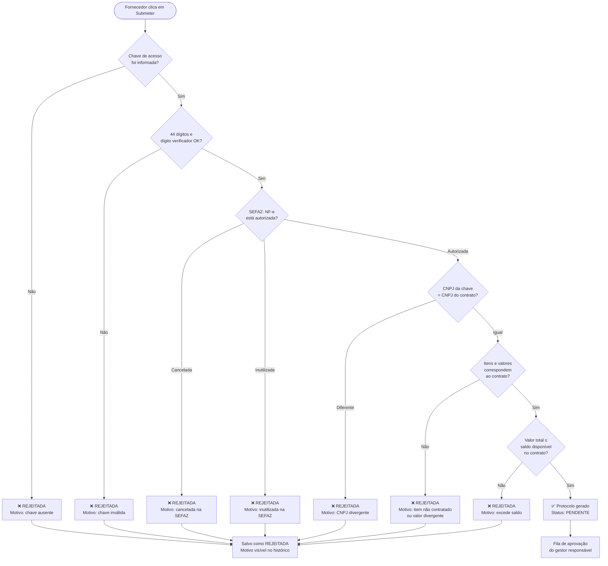
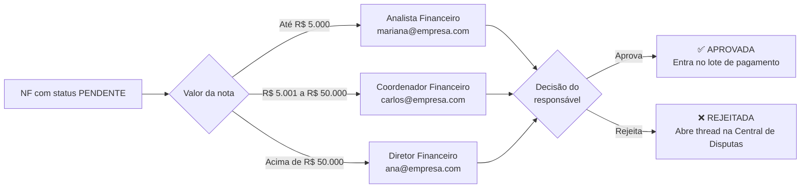
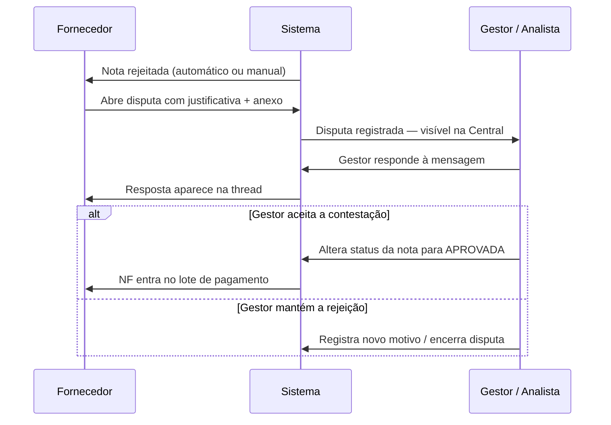
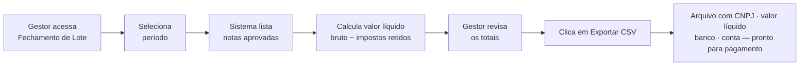

# GovFiscal — Documentação do Sistema

> **Sistema Procure-to-Pay (P2P) com Validação de Nota Fiscal Eletrônica**
> Automatiza o recebimento, validação e aprovação de NF-e em empresas e órgãos públicos.

---

## Acesso ao Sistema

| | |
|---|---|
| **URL de produção** | https://govfiscal.vercel.app |
| **Stack** | React 18 · Vite · Tailwind CSS · Supabase (PostgreSQL) |
| **Autenticação** | E-mail + senha via Supabase Auth |

### Contas de demonstração

| Perfil | E-mail | Senha | Entra em |
|---|---|---|---|
| Administrador | `ana@empresa.com` | `GovFiscal@2025` | `/dashboard` |
| Gestor Financeiro | `carlos@empresa.com` | `GovFiscal@2025` | `/dashboard` |
| Analista Financeiro | `mariana@empresa.com` | `GovFiscal@2025` | `/disputas` |
| Fornecedor | `contato@empresaalfa.com.br` | `GovFiscal@2025` | `/fornecedor` |

> Na tela de login existem botões de acesso rápido — basta clicar no perfil desejado e depois em **Entrar**.

---

## Sumário

1. [O que o sistema faz](#1-o-que-o-sistema-faz)
2. [Como fazer login](#2-como-fazer-login)
3. [Guia por perfil](#3-guia-por-perfil)
4. [Fluxo completo — passo a passo](#4-fluxo-completo--passo-a-passo)
5. [Fluxogramas](#5-fluxogramas)
6. [Papéis e permissões](#6-papéis-e-permissões)
7. [Casos de teste prontos](#7-casos-de-teste-prontos)
8. [Banco de dados e estrutura técnica](#8-banco-de-dados-e-estrutura-técnica)
9. [Instalação local](#9-instalação-local)

---

## 1. O que o sistema faz

O GovFiscal automatiza o ciclo completo de uma Nota Fiscal Eletrônica (NF-e), desde o envio pelo fornecedor até o pagamento. O objetivo é eliminar fraudes e erros manuais como:

- Notas com CNPJ diferente do contrato
- Valores que excedem o saldo contratual
- Itens cobrados que não constam no contrato
- Chaves de acesso com dígito verificador incorreto

### Ciclo de vida de uma NF no GovFiscal

```
Fornecedor envia NF
        │
        ▼
Validação automática (5 etapas)
        │
   ┌────┴────┐
   │         │
Reprovada  Aprovada pelo sistema
   │         │
Salva como  Vai para a fila de aprovação humana
"rejeitada"  │
             ▼
      Gestor aprova ou rejeita
             │
        ┌────┴────┐
        │         │
    Aprovada   Rejeitada
        │         │
   Entra no   Fornecedor pode
   lote de    contestar em
   pagamento  Central de Disputas
```

---

## 2. Como fazer login

1. Acesse **https://govfiscal.vercel.app**
2. A tela de login abre automaticamente em `/acesso`
3. Use os **botões de acesso rápido** para preencher email e senha automaticamente
4. Clique em **Entrar**
5. O sistema redireciona para a área correta conforme o perfil

```
Administrador  → Dashboard (/dashboard)
Gestor         → Dashboard (/dashboard)
Analista       → Central de Disputas (/disputas)
Fornecedor     → Portal do Fornecedor (/fornecedor)
```

---

## 3. Guia por perfil

### 3.1 Fornecedor

**Acesso:** `contato@empresaalfa.com.br` / `GovFiscal@2025`

O fornecedor tem acesso ao **Portal do Fornecedor**, onde pode:
- Enviar novas notas fiscais
- Acompanhar o status das notas enviadas
- Contestar rejeições na Central de Disputas

#### Como enviar uma nota fiscal

1. Clique em **Nova Nota Fiscal** (ou o botão equivalente na tela)
2. **Selecione o contrato** — a lista mostra apenas contratos ativos do seu CNPJ
3. Preencha o **Número da NF** (ex: `NF-2025-100`)
4. Selecione o **Tipo de serviço** — define quais impostos serão retidos
5. Digite a **Chave de Acesso NF-e** (44 dígitos que constam no DANFE ou no XML)
   - O campo valida em tempo real:
   - Ícone verde = chave com formato correto
   - Ícone vermelho = erro (o motivo é exibido abaixo)
6. Adicione os **itens da nota** — use os mesmos códigos do contrato
7. **Anexe** o arquivo XML ou PDF da nota
8. Clique em **Submeter para validação**

#### O que acontece depois do envio

- Se a nota passar nas 5 validações automáticas → aparece com status **pendente**, aguardando aprovação do gestor
- Se a nota falhar em qualquer validação → status **rejeitada** com o motivo detalhado

#### Como contestar uma rejeição

1. Acesse **Central de Disputas** pelo menu lateral
2. Selecione a nota rejeitada na lista
3. Escreva a justificativa na caixa de mensagem
4. Se necessário, anexe um documento comprobatório
5. Clique em **Enviar**
6. A mensagem fica registrada permanentemente e o gestor será notificado

---

### 3.2 Analista Financeiro

**Acesso:** `mariana@empresa.com` / `GovFiscal@2025`

O analista não aprova notas — isso é função do gestor. O analista atua na **Central de Disputas**:

1. Ao fazer login, a Central de Disputas abre automaticamente
2. A lista à esquerda mostra todas as disputas abertas
3. Clique em uma disputa para ver o histórico de mensagens
4. Responda ao fornecedor na caixa de texto
5. Quando necessário, escalone o caso para o gestor

---

### 3.3 Gestor Financeiro

**Acesso:** `carlos@empresa.com` / `GovFiscal@2025`

O gestor acessa o **Dashboard** com todas as notas pendentes de aprovação.

#### Como aprovar ou rejeitar uma nota

1. No **Dashboard**, localize a seção **Fila de Aprovação**
2. Cada linha mostra: fornecedor, número da NF, valor, protocolo e alçada responsável
3. Clique em **Aprovar** → nota muda para `aprovada` e entra no lote de pagamento
4. Clique em **Rejeitar** → informe o motivo → nota muda para `rejeitada`

#### Como fazer o fechamento de lote

1. Acesse **Fechamento de Lote** (`/fechamento`) pelo menu lateral
2. Selecione o **período de referência** (mês/ano)
3. O sistema lista todas as notas aprovadas no período, com o valor líquido já calculado (bruto − retenções)
4. Verifique os totais
5. Clique em **Exportar CSV** → arquivo pronto para importação no sistema de pagamento

#### Como responder disputas

1. Acesse **Central de Disputas** (`/disputas`)
2. Veja as mensagens enviadas pelos fornecedores
3. Responda diretamente na thread
4. Se decidir reverter a rejeição, altere o status da nota para `aprovada`

---

### 3.4 Administrador

**Acesso:** `ana@empresa.com` / `GovFiscal@2025`

O administrador tem acesso completo ao sistema, incluindo as telas de configuração:

| Módulo | Caminho | O que faz |
|---|---|---|
| Dashboard | `/dashboard` | KPIs, fila de aprovação, auditoria |
| Fornecedores | `/fornecedores` | Cadastrar e editar fornecedores |
| Contratos | `/contratos` | Cadastrar contratos com itens e saldos |
| Alçadas | `/alcadas` | Definir faixas de valor e responsáveis de aprovação |
| Usuários | `/usuarios` | Criar e editar usuários e seus papéis |
| Disputas | `/disputas` | Ver e responder contestações |
| Fechamento | `/fechamento` | Exportar lotes para pagamento |
| Calendário Fiscal | `/calendario-fiscal` | Datas de vencimentos fiscais |

---

## 4. Fluxo completo — passo a passo

O exemplo abaixo mostra o ciclo completo de uma NF, do envio ao pagamento.

### Etapa 1 — Fornecedor envia a nota

1. Login: `contato@empresaalfa.com.br`
2. Portal do Fornecedor → preenche o formulário com os dados da NF
3. Sistema executa as **5 validações automáticas** (ver seção 5.1)
4. Se tudo OK: protocolo gerado, nota fica com status `pendente`

### Etapa 2 — Gestor aprova

1. Login: `carlos@empresa.com`
2. Dashboard → Fila de Aprovação → nota aparece na lista
3. Gestor clica em **Aprovar**
4. Nota muda para `aprovada`

### Etapa 3 — Lote de pagamento

1. Login: `carlos@empresa.com`
2. Fechamento de Lote → seleciona período
3. A nota aprovada aparece na lista com valor líquido calculado
4. Exporta CSV com dados para o sistema de pagamento

### Etapa alternativa — Nota rejeitada e contestada

1. Gestor clica em **Rejeitar** informando motivo
2. Fornecedor acessa Central de Disputas e envia contestação
3. Gestor responde e pode reverter a decisão

---

## 5. Fluxogramas

### 5.1 Validação automática (Two-Way Matching — 5 etapas)



---

### 5.2 Aprovação por alçada (faixas de valor)



---

### 5.3 Central de Disputas



---

### 5.4 Fechamento de lote e exportação



---

### 5.5 Estrutura da Chave de Acesso NF-e (44 dígitos)

```
 Posição:  00–01  02–05  06–19           20–21  22–24  25–33      34     35–42     43
 Campo:     cUF   AAMM   CNPJ (14 dig)   mod    serie  nNF (9)   tpEmis  cNF (8)  cDV
 Exemplo:    35   2501   12345678000190   55     001    000000001    1    12345678    1
 Significado: SP  Jan/25 CNPJ do emissor  NF-e   série  nº da NF   emissão código  DV
```

**Como o dígito verificador (DV) é calculado:**

1. Pegue os primeiros 43 dígitos da chave
2. Multiplique cada dígito (da direita para esquerda) pelos pesos 2, 3, 4, 5, 6, 7, 8, 9 — repetindo o ciclo
3. Some todos os resultados
4. Calcule: `resto = soma % 11`
5. Se `resto < 2` → DV = 0; caso contrário → DV = 11 − resto

---

## 6. Papéis e permissões

| Funcionalidade | Admin | Gestor | Analista | Fornecedor |
|---|:---:|:---:|:---:|:---:|
| Login | ✅ | ✅ | ✅ | ✅ |
| Dashboard (KPIs e fila) | ✅ | ✅ | — | — |
| Aprovar / rejeitar NF | ✅ | ✅ | — | — |
| Portal do Fornecedor (enviar NF) | — | — | — | ✅ |
| Ver histórico das próprias NFs | — | — | — | ✅ |
| Central de Disputas | ✅ | ✅ | ✅ | ✅ |
| Fechamento de Lote (CSV) | ✅ | ✅ | — | — |
| Calendário Fiscal | ✅ | ✅ | — | — |
| Cadastro de Fornecedores | ✅ | ✅ | — | — |
| Cadastro de Contratos | ✅ | ✅ | — | — |
| Configuração de Alçadas | ✅ | ✅ | — | — |
| Gestão de Usuários | ✅ | — | — | — |
| FAQ | ✅ | ✅ | ✅ | ✅ |

> **Analista:** só acessa Central de Disputas e FAQ — não vê o dashboard nem aprova notas.
> **Fornecedor:** vê apenas as próprias notas (filtradas pelo CNPJ cadastrado no perfil).

---

## 7. Casos de teste prontos

O banco já está populado com dados de exemplo. Basta seguir os roteiros abaixo.

### 7.1 Dados carregados (seed.sql)

**Notas fiscais disponíveis:**

| NF | Fornecedor | Valor | Status | Motivo |
|---|---|---|---|---|
| NF-2025-001 | Empresa Alfa | R$ 15.000 | ✅ aprovada | Fluxo completo OK |
| NF-2025-002 | TechSoft | R$ 8.000 | ✅ aprovada | Fluxo completo OK |
| NF-2025-003 | Construções Beta | R$ 5.500 | ✅ aprovada | Fluxo completo OK |
| NF-2025-004 | Empresa Alfa | R$ 22.500 | ⏳ pendente | Aguarda aprovação do Coordenador |
| NF-2025-005 | TechSoft | R$ 4.200 | ⏳ pendente | Aguarda aprovação do Analista |
| NF-2025-006 | Empresa Alfa | R$ 95.000 | ❌ rejeitada | Excede saldo do contrato (R$ 62.500) |
| NF-2025-007 | Construções Beta | R$ 3.000 | ❌ rejeitada | Item LMP-999 não consta no contrato |
| NF-2025-008 | Serviços Gamma | R$ 2.000 | ❌ rejeitada | Chave com 40 dígitos (inválida) |

**Contratos disponíveis:**

| Contrato | Fornecedor | Valor Total | Saldo Disponível |
|---|---|---|---|
| CTR-2025-001 | Empresa Alfa Ltda | R$ 100.000 | R$ 62.500 |
| CTR-2025-002 | TechSoft Soluções | R$ 50.000 | R$ 32.000 |
| CTR-2025-003 | Construções Beta | R$ 30.000 | R$ 22.000 |
| CTR-2025-004 | Serviços Gamma | R$ 80.000 | R$ 55.000 |

---

### 7.2 Teste 1 — Login e navegação por perfil

**Objetivo:** confirmar que cada perfil redireciona para a tela correta.

| Passo | O que fazer | O que deve aparecer |
|---|---|---|
| 1 | Abra https://govfiscal.vercel.app | Tela de login com 4 botões de acesso rápido |
| 2 | Clique no botão **Gestor** | Campo e-mail preenchido com `carlos@empresa.com` |
| 3 | Clique em **Entrar** | Redireciona para `/dashboard` com a fila de aprovação |
| 4 | Veja a fila de aprovação | NF-2025-004 (R$ 22.500) e NF-2025-005 (R$ 4.200) visíveis |
| 5 | Clique em Logout | Volta para a tela de login |
| 6 | Clique no botão **Fornecedor** e entre | Redireciona para `/fornecedor` com os contratos da Empresa Alfa |

---

### 7.3 Teste 2 — Envio de NF com validação aprovada (fluxo feliz)

**Login:** `contato@empresaalfa.com.br` / `GovFiscal@2025`

| Campo | Valor |
|---|---|
| Contrato | CTR-2025-001 |
| Número da NF | NF-2025-100 |
| Tipo de serviço | Serviços de TI / Software |
| Chave de acesso | `35250112345678000190550010000000011123456781` |
| Item — código | SRV-001 |
| Item — quantidade | 10 |
| Item — valor unitário | 150,00 |
| Anexo | qualquer arquivo PDF |

**Resultado esperado:**
- Enquanto digita a chave → ícone verde aparece ao completar 44 dígitos
- Após clicar em **Submeter**: `Nota enviada. Protocolo: PROT-XXXXXXXXX. Aguardando aprovação.`
- Nota aparece no histórico com status `pendente`
- Ao logar como gestor, a nota aparece na fila de aprovação do dashboard

---

### 7.4 Teste 3 — Rejeição automática: dígito verificador errado

**Login:** `contato@empresaalfa.com.br`

| Campo | Valor |
|---|---|
| Contrato | CTR-2025-001 |
| Número da NF | NF-TESTE-001 |
| Chave de acesso | `35250112345678000190550010000000011123456789` |

> O último dígito é 9, mas o correto é 1. O sistema detecta isso pelo cálculo do Módulo 11.

**Resultado esperado:**
- Ícone vermelho aparece no campo da chave
- Mensagem abaixo: `Dígito verificador incorreto — informado: 9, calculado: 1`
- O formulário **não é submetido** — o botão fica bloqueado

---

### 7.5 Teste 4 — Rejeição automática: CNPJ diferente do contrato

**Login:** `contato@empresaalfa.com.br`

| Campo | Valor |
|---|---|
| Contrato | CTR-2025-001 (CNPJ Alfa: 12.345.678/0001-90) |
| Número da NF | NF-TESTE-002 |
| Chave de acesso | `35250298765432000100550010000000011876543218` |
| Anexo + item | qualquer |

> A chave acima pertence à TechSoft (CNPJ 98765432000100), mas o contrato é da Empresa Alfa.

**Resultado esperado:**
- Nota salva como `rejeitada`
- Motivo: `CNPJ embutido na chave (98765432000100) não confere com o CNPJ do contrato (12345678000190)`

---

### 7.6 Teste 5 — Rejeição automática: valor excede saldo do contrato

**Login:** `contato@empresaalfa.com.br`

| Campo | Valor |
|---|---|
| Contrato | CTR-2025-001 (saldo disponível: R$ 62.500) |
| Chave de acesso | `35250112345678000190550010000000011123456781` |
| Item — código | SRV-001 |
| Item — quantidade | 500 |
| Item — valor unitário | 150,00 (total: R$ 75.000) |

**Resultado esperado:**
- Nota salva como `rejeitada`
- Motivo: `Valor bruto (R$ 75.000,00) excede o saldo disponível do contrato (R$ 62.500,00)`

---

### 7.7 Teste 6 — Aprovação de NF no dashboard (Gestor)

**Login:** `carlos@empresa.com`

| Passo | O que fazer | O que deve aparecer |
|---|---|---|
| 1 | Acesse `/dashboard` | Fila de aprovação com NF-2025-004 e NF-2025-005 |
| 2 | Clique em **Aprovar** na NF-2025-004 (R$ 22.500) | Status muda para `aprovada` |
| 3 | Acesse `/fechamento` | NF-2025-004 aparece na lista do lote |
| 4 | Clique em **Exportar CSV** | Download do arquivo com os dados de pagamento |

---

### 7.8 Teste 7 — Rejeição manual e disputa (Gestor + Fornecedor)

**Parte 1 — Gestor rejeita a NF-2025-005:**

| Passo | O que fazer |
|---|---|
| 1 | Login: `carlos@empresa.com` → Dashboard |
| 2 | Localize NF-2025-005 (R$ 4.200) na fila |
| 3 | Clique em **Rejeitar** |
| 4 | Informe o motivo: `Documentação incompleta` |
| 5 | Confirme → status muda para `rejeitada` |

**Parte 2 — Fornecedor abre disputa:**

| Passo | O que fazer |
|---|---|
| 1 | Login: `contato@empresaalfa.com.br` → Central de Disputas |
| 2 | Selecione a NF-2025-005 na lista |
| 3 | Escreva: `Segue documentação completa em anexo` |
| 4 | Anexe um arquivo e clique em **Enviar** |

**Parte 3 — Gestor responde:**

| Passo | O que fazer |
|---|---|
| 1 | Login: `carlos@empresa.com` → Central de Disputas |
| 2 | Veja a mensagem do fornecedor na thread |
| 3 | Responda e, se aceitar, altere o status da nota para `aprovada` |

---

### 7.9 Chaves de acesso válidas para testes

| Fornecedor | CNPJ | Chave válida (44 dígitos) |
|---|---|---|
| Empresa Alfa Ltda | 12.345.678/0001-90 | `35250112345678000190550010000000011123456781` |
| TechSoft Soluções | 98.765.432/0001-00 | `35250298765432000100550010000000011876543218` |

---

## 8. Banco de dados e estrutura técnica

### 8.1 Diagrama Entidade-Relacionamento

```
 fornecedor                   contrato
 ──────────                   ────────
 id (PK)                      id (PK)
 razao_social                 numero_contrato
 cnpj ◄──────── liga pelo ──► cnpj_fornecedor
 email                        valor_total
 telefone                     saldo_disponivel
 endereco                     itens_json ← array de itens contratados
 responsavel                  data_inicio / data_fim
 status                       status


 nota_fiscal                  disputa
 ───────────                  ───────
 id (PK)                      id (PK)
 numero_nota                  nota_fiscal_id (FK) ──► nota_fiscal.id
 numero_contrato ──────────► contrato.numero_contrato
 cnpj_emissor                 autor (nome)
 chave_acesso ← 44 dígitos   papel (fornecedor | gestor)
 valor_bruto                  mensagem
 items_json                   arquivo_url
 status ← pendente|aprovada|rejeitada
 motivo_rejeicao
 protocolo
 arquivo_url / arquivo_nome


 alcada                       app_user
 ──────                       ────────
 id (PK)                      id (PK)
 nivel                        nome
 valor_min                    email
 valor_max                    role ← admin|gestor|analista|fornecedor
 responsavel                  cnpj ← obrigatório para perfil fornecedor
 email_responsavel            razao_social
 ativo                        status
```

### 8.2 Campos importantes

| Tabela | Campo | Por que importa |
|---|---|---|
| `nota_fiscal` | `chave_acesso` | 44 dígitos validados no formulário antes de salvar |
| `nota_fiscal` | `status` | `pendente` → aguarda aprovação; `aprovada` → vai pro CSV; `rejeitada` → vai para disputas |
| `nota_fiscal` | `motivo_rejeicao` | Formato `[tipo_rejeicao] mensagem explicativa` |
| `contrato` | `itens_json` | Array com código, valor unitário e quantidade máxima de cada item |
| `app_user` | `cnpj` | Obrigatório para `role = fornecedor` — filtra contratos e notas exibidas |

### 8.3 Segurança

Todas as tabelas têm **Row Level Security (RLS)** habilitado no Supabase. Na versão de demonstração as policies permitem acesso autenticado para facilitar os testes. Em produção, cada policy deve ser restrita ao perfil correspondente.

### 8.4 Arquitetura de autenticação

```
1. Usuário informa e-mail + senha na tela /acesso
        │
        ▼
2. Supabase Auth valida as credenciais em auth.users
        │
        ▼
3. AuthContext.jsx busca o perfil em app_user pelo e-mail
        │
        ▼
4. O campo "role" define o que o usuário pode acessar
        │
        ▼
5. App.jsx redireciona para a tela correta
```

---

## 9. Instalação local

### Pré-requisitos

- Node.js 18 ou superior
- Conta no [Supabase](https://supabase.com) com um projeto criado

### Passo a passo

```bash
# 1. Instalar dependências
npm install

# 2. Configurar variáveis de ambiente
cp .env.example .env
# Abra o .env e preencha com os dados do seu projeto Supabase:
#   VITE_SUPABASE_URL=https://SEU_PROJETO.supabase.co
#   VITE_SUPABASE_ANON_KEY=sua_chave_anonima_aqui

# 3. Criar o schema do banco de dados
# No Supabase: SQL Editor → New Query → cole o conteúdo de supabase/migration.sql → Run

# 4. Popular com dados de exemplo
# No Supabase: SQL Editor → New Query → cole o conteúdo de supabase/seed.sql → Run

# 5. Rodar o servidor de desenvolvimento
npm run dev
# Acesse: http://localhost:5173

# 6. Gerar o build de produção
npm run build
npm run preview   # testa o build localmente em http://localhost:4173
```

### Deploy na Vercel

```bash
# Instalar a CLI
npm install -g vercel

# Fazer login
vercel login

# Fazer o deploy
vercel

# Adicionar variáveis de ambiente
vercel env add VITE_SUPABASE_URL
vercel env add VITE_SUPABASE_ANON_KEY

# Redesployar com as variáveis ativas
vercel --prod
```
