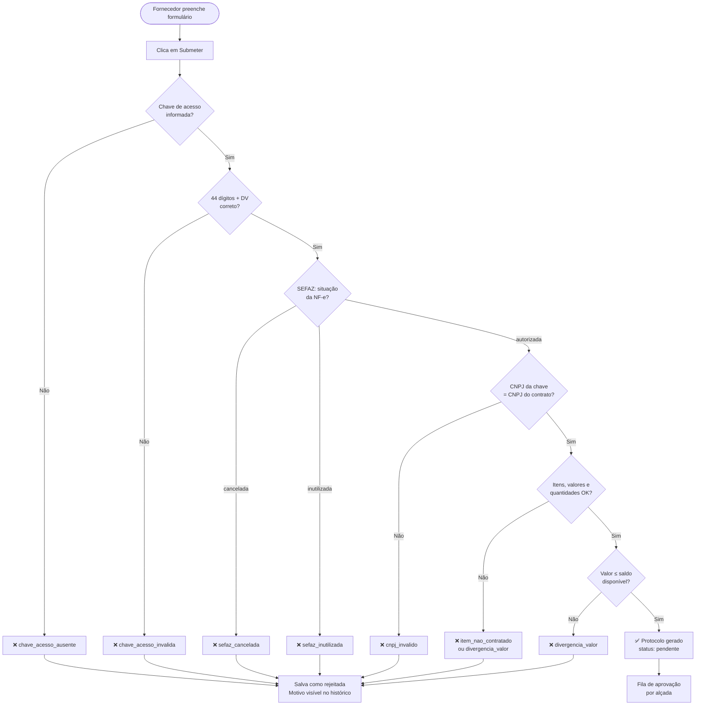
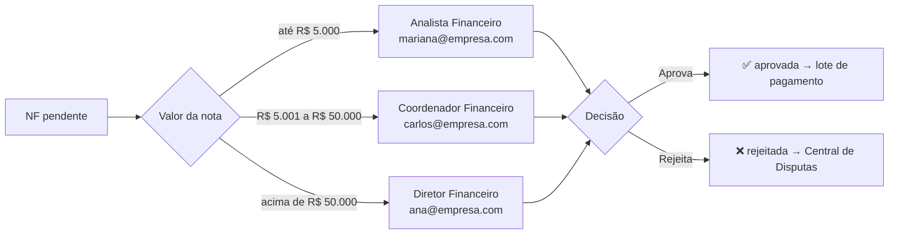
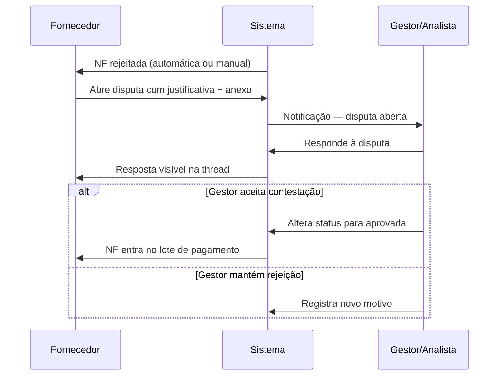
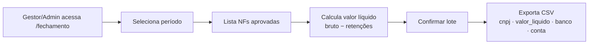

# GovFiscal — Documentação Completa

> Sistema Procure-to-Pay (P2P) com validação de Nota Fiscal Eletrônica
> Stack: React 18 · Vite · Tailwind CSS · shadcn/ui · Supabase (PostgreSQL 15)

---

## Sumário

1. [Visão Geral](#1-visão-geral)
2. [Tecnologias](#2-tecnologias)
3. [Instalação e Configuração](#3-instalação-e-configuração)
4. [Arquitetura](#4-arquitetura)
5. [Módulos e Rotas](#5-módulos-e-rotas)
6. [Fluxogramas](#6-fluxogramas)
7. [Papéis e Permissões](#7-papéis-e-permissões)
8. [Banco de Dados](#8-banco-de-dados)
9. [Guia de Uso por Perfil](#9-guia-de-uso-por-perfil)
10. [Casos de Teste Completos](#10-casos-de-teste-completos)

---

## 1. Visão Geral

O **GovFiscal** automatiza o ciclo completo de recebimento e aprovação de Notas Fiscais Eletrônicas (NF-e) em empresas e órgãos públicos. O sistema valida automaticamente cada nota contra o contrato correspondente antes de encaminhá-la para aprovação humana.

**Problema que resolve:** notas superfaturadas, duplicadas ou com CNPJ divergente chegam ao pagamento sem conferência. O GovFiscal bloqueia automaticamente qualquer nota que não passe nas 5 etapas de validação.

---

## 2. Tecnologias

| Camada | Tecnologia |
|---|---|
| Frontend | React 18 + Vite 5 |
| UI | Tailwind CSS + shadcn/ui |
| Autenticação | Supabase Auth (email + senha) |
| Banco de dados | PostgreSQL 15 via Supabase |
| Segurança | Row Level Security (RLS) |
| Estado assíncrono | React Query (@tanstack/react-query) |
| Roteamento | React Router DOM v6 |
| Validação NF-e | Módulo 11 (dígito verificador) — `src/lib/nfeValidation.js` |
| Motor tributário | Stateless — `src/lib/tributario.js` |

---

## 3. Instalação e Configuração

### 3.1 Pré-requisitos

- Node.js 18+
- Conta no [Supabase](https://supabase.com) com projeto criado

### 3.2 Passo a passo

```bash
# 1. Instalar dependências
npm install

# 2. Configurar variáveis de ambiente
cp .env.example .env
# Editar .env com URL e ANON KEY do projeto Supabase

# 3. Criar schema do banco
# Supabase → SQL Editor → New Query → colar migration.sql → Run

# 4. Popular dados de exemplo
# Supabase → SQL Editor → New Query → colar seed.sql → Run

# 5. Rodar o servidor
npm run dev
# Acesse: http://localhost:5173
```

### 3.3 Variáveis de ambiente

```env
VITE_SUPABASE_URL=https://SEU_PROJETO.supabase.co
VITE_SUPABASE_ANON_KEY=sua_chave_anonima_aqui
```

---

## 4. Arquitetura

```
┌─────────────────────────────────────────────────────────────┐
│                        NAVEGADOR (SPA)                      │
│                                                             │
│  React Router  ──▶  App.jsx (rotas + guards de acesso)     │
│                          │                                  │
│                    AuthContext.jsx                          │
│                    (sessão Supabase Auth → perfil app_user) │
│                          │                                  │
│       ┌──────────────────┴──────────────────┐              │
│       │ src/lib/nfeValidation.js             │              │
│       │ • validarChaveAcesso() — módulo 11   │              │
│       │ • consultarSefaz()    — simulado     │              │
│       │ • extrairCnpjDaChave()               │              │
│       └──────────────────┬──────────────────┘              │
│                          │                                  │
│       ┌──────────────────┴──────────────────┐              │
│       │ src/components/api/mockWebhook.js    │              │
│       │ Two-Way Matching — 5 etapas          │              │
│       └──────────────────┬──────────────────┘              │
│                          │                                  │
│       ┌──────────────────┴──────────────────┐              │
│       │ src/api/base44Client.js              │              │
│       │ CRUD genérico → Supabase             │              │
│       └──────────────────┬──────────────────┘              │
└─────────────────────────┬───────────────────────────────────┘
                          │ supabaseClient.js
                          ▼
┌─────────────────────────────────────────────────────────────┐
│                     SUPABASE                                │
│  auth.users  ◄── login (email + senha)                     │
│  app_user    ◄── perfil (role, cnpj, razao_social)          │
│  fornecedor · contrato · nota_fiscal · alcada · disputa     │
│  RLS habilitado em todas as tabelas                         │
└─────────────────────────────────────────────────────────────┘
```

### Como a autenticação funciona

1. Usuário entra com email + senha na tela `/acesso`
2. Supabase Auth valida as credenciais (`auth.users`)
3. `AuthContext` busca o perfil em `app_user` pelo email
4. O campo `role` do perfil define o que o usuário pode ver
5. Redirecionamento automático conforme o papel (ver seção 7)

---

## 5. Módulos e Rotas

| Rota | Página | Quem acessa |
|---|---|---|
| `/acesso` | Login | Todos (não autenticados) |
| `/dashboard` | KPIs, fila de aprovação, auditoria | admin, gestor |
| `/fornecedor` | Envio de NF + histórico | fornecedor |
| `/disputas` | Central de disputas | admin, gestor, analista, fornecedor |
| `/fornecedores` | Cadastro de fornecedores | admin, gestor |
| `/contratos` | Cadastro de contratos | admin, gestor |
| `/alcadas` | Configuração de alçadas | admin, gestor |
| `/fechamento` | Fechamento de lote + exportação CSV | admin, gestor |
| `/calendario-fiscal` | Calendário de vencimentos fiscais | admin, gestor |
| `/faq` | Perguntas frequentes | todos |
| `/usuarios` | Gestão de usuários | admin |

### Redirecionamento após login

```
fornecedor → /fornecedor
analista   → /disputas
gestor     → /dashboard
admin      → /dashboard
```

> **Atenção:** analista não tem acesso ao `/dashboard`. Seu ponto de entrada é a Central de Disputas.

---

## 6. Fluxogramas

### 6.1 Envio e Validação de NF (5 etapas em sequência)



### 6.2 Aprovação por Alçada



### 6.3 Central de Disputas



### 6.4 Fechamento de Lote



### 6.5 Estrutura da Chave de Acesso NF-e (44 dígitos)

```
Posições:  [00-01] [02-05] [06-19]         [20-21] [22-24] [25-33]    [34]  [35-42]   [43]
Campo:       cUF    AAMM    CNPJ (14 dig)   mod     serie   nNF (9)   tpE   cNF (8)   cDV
Significado: UF     MMAA    CNPJ emissor    55=NFe  série   número    tipo  código    DV
Exemplo:      35    2501    12345678000190   55      001    000000001   1    12345678   1
              SP    Jan/25  CNPJ Alfa        NF-e    série  NF nº 1    emis  código    DV
```

**Cálculo do DV (Módulo 11):**
- Multiplica cada dígito (da direita para esquerda) pelos pesos 2, 3, 4, 5, 6, 7, 8, 9 (ciclando)
- Soma os produtos
- `resto = soma % 11`
- `DV = resto < 2 ? 0 : 11 - resto`

---

## 7. Papéis e Permissões

| Módulo / Ação | admin | gestor | analista | fornecedor |
|---|:---:|:---:|:---:|:---:|
| Fazer login e usar o sistema | ✅ | ✅ | ✅ | ✅ |
| Portal do Fornecedor (enviar NF) | — | — | — | ✅ |
| Ver histórico das próprias NFs | — | — | — | ✅ |
| Dashboard (KPIs, fila, auditoria) | ✅ | ✅ | — | — |
| Aprovar / rejeitar NF | ✅ | ✅ | — | — |
| Central de Disputas | ✅ | ✅ | ✅ | ✅ |
| Fechamento de Lote (CSV) | ✅ | ✅ | — | — |
| Calendário Fiscal | ✅ | ✅ | — | — |
| Cadastro de Fornecedores | ✅ | ✅ | — | — |
| Cadastro de Contratos | ✅ | ✅ | — | — |
| Configuração de Alçadas | ✅ | ✅ | — | — |
| Gestão de Usuários | ✅ | — | — | — |
| FAQ | ✅ | ✅ | ✅ | ✅ |

> O analista só acessa a Central de Disputas e o FAQ.
> O fornecedor só vê as suas próprias notas (filtradas pelo CNPJ do perfil).

---

## 8. Banco de Dados

### 8.1 Diagrama ER

```
fornecedor ──────────────────────────────────┐
  id PK                                       │ cnpj_fornecedor
  razao_social, cnpj, email                   │
  telefone, endereco, responsavel             │
                                             ▼
contrato ─────────────────────────────────────┐
  id PK                                        │ numero_contrato
  numero_contrato, cnpj_fornecedor             │
  valor_total, saldo_disponivel                │
  itens_json  ← array de itens                │
  data_inicio, data_fim, status               │
                                              ▼
nota_fiscal ─────────────────────────────────────────────┐
  id PK                                                    │ nota_fiscal_id
  cnpj_emissor, numero_nota, numero_contrato               │
  chave_acesso  ← 44 dígitos NF-e                         │
  valor_bruto, items_json                                  │
  status  (pendente | aprovada | rejeitada)                │
  motivo_rejeicao, protocolo, tipo_servico                 │
  arquivo_url, arquivo_nome                                │
  fornecedor_nome, email_fornecedor                        │
                                                          ▼
disputa
  id PK
  nota_fiscal_id FK
  autor, papel  (fornecedor | gestor)
  mensagem, arquivo_url, arquivo_nome

alcada
  id PK
  nivel, valor_min, valor_max
  responsavel, email_responsavel, ativo

app_user
  id PK
  nome, email, role
  cnpj, razao_social  ← obrigatório para perfil fornecedor
  status
```

### 8.2 Campos críticos

| Tabela | Campo | Uso |
|---|---|---|
| `nota_fiscal` | `chave_acesso` | 44 dígitos da NF-e; validado no formulário antes de salvar |
| `nota_fiscal` | `status` | `pendente` → aprovação manual; `aprovada` → entra no CSV; `rejeitada` → Central de Disputas |
| `nota_fiscal` | `motivo_rejeicao` | Formato `[tipo_rejeicao] mensagem` |
| `contrato` | `itens_json` | Array com `codigo`, `valor_unitario`, `quantidade_maxima` |
| `app_user` | `cnpj` | Obrigatório para `role = fornecedor`; filtra contratos e notas |

---

## 9. Guia de Uso por Perfil

### 9.1 Fornecedor

**Acesso:** `contato@empresaalfa.com.br` / `GovFiscal@2025` → redireciona para `/fornecedor`

**Como enviar uma nota:**
1. Selecione o contrato no seletor (exibe apenas contratos ativos do seu CNPJ)
2. Preencha o **Número da NF** (ex: `NF-2025-100`)
3. Escolha o **Tipo de serviço** — afeta o cálculo de impostos retidos
4. Informe a **Chave de Acesso** (44 dígitos do DANFE ou XML)
   - O campo valida em tempo real: ícone verde = formato correto; vermelho = erro com detalhe
5. Adicione os itens: código exato como no contrato, quantidade e valor unitário
6. Clique em **Anexo** e selecione o arquivo XML ou PDF
7. Clique em **Submeter para validação**
8. O resultado aparece imediatamente abaixo do botão:
   - Aprovado automaticamente → protocolo gerado, aguarda aprovação humana
   - Rejeitado → motivo detalhado exibido e salvo no histórico

**Como contestar uma rejeição:**
1. Acesse o menu **Central de Disputas**
2. Selecione a nota rejeitada na lista à esquerda
3. Escreva a justificativa na caixa de texto e, se necessário, anexe um documento
4. Clique em **Enviar** (ou pressione Ctrl+Enter)
5. A mensagem fica gravada de forma permanente (não pode ser editada ou apagada)

---

### 9.2 Analista Financeiro

**Acesso:** `mariana@empresa.com` / `GovFiscal@2025` → redireciona para `/disputas`

O analista não aprova notas diretamente — isso é responsabilidade do gestor no dashboard. O analista:
1. Acompanha a **Central de Disputas** — vê todos os casos abertos
2. Responde às mensagens dos fornecedores
3. Escalona para o gestor quando necessário

---

### 9.3 Gestor Financeiro

**Acesso:** `carlos@empresa.com` / `GovFiscal@2025` → redireciona para `/dashboard`

**Aprovar / Rejeitar NFs:**
1. Dashboard → seção **Fila de Aprovação**
2. Cada linha mostra: fornecedor, valor, protocolo, alçada responsável
3. Clique em **Aprovar** ou **Rejeitar com motivo**
4. A nota aprovada entra automaticamente no próximo lote de pagamento

**Fechamento de Lote:**
1. Acesse `/fechamento`
2. Selecione o período de referência
3. O sistema lista todas as notas aprovadas com valor líquido (já com retenções deduzidas)
4. Clique em **Exportar CSV** — arquivo pronto para importação no sistema de pagamento

**Central de Disputas:**
1. Acesse `/disputas`
2. Veja as contestações abertas pelos fornecedores
3. Responda e decida se reverte a rejeição

---

### 9.4 Administrador

**Acesso:** `ana@empresa.com` / `GovFiscal@2025` → redireciona para `/dashboard`

Acesso completo a todos os módulos, mais:
- `/fornecedores` — cadastrar e editar fornecedores
- `/contratos` — cadastrar contratos com itens e saldos
- `/alcadas` — configurar faixas de valor e responsáveis de aprovação
- `/usuarios` — criar/editar usuários e seus papéis

---

## 10. Casos de Teste Completos

### 10.1 Usuários de Acesso Rápido (botões na tela de login)

| E-mail | Senha | Papel | Redireciona para |
|---|---|---|---|
| `ana@empresa.com` | `GovFiscal@2025` | Administrador | `/dashboard` |
| `carlos@empresa.com` | `GovFiscal@2025` | Gestor Financeiro | `/dashboard` |
| `mariana@empresa.com` | `GovFiscal@2025` | Analista Financeiro | `/disputas` |
| `contato@empresaalfa.com.br` | `GovFiscal@2025` | Fornecedor | `/fornecedor` |

---

### 10.2 Dados já carregados no banco (após seed.sql)

**Notas fiscais disponíveis:**

| ID | NF | Fornecedor | Valor | Status | Por quê |
|---|---|---|---|---|---|
| nf_001 | NF-2025-001 | Empresa Alfa | R$ 15.000 | ✅ aprovada | Fluxo OK |
| nf_002 | NF-2025-002 | TechSoft | R$ 8.000 | ✅ aprovada | Fluxo OK |
| nf_003 | NF-2025-003 | Construções Beta | R$ 5.500 | ✅ aprovada | Fluxo OK |
| nf_004 | NF-2025-004 | Empresa Alfa | R$ 22.500 | ⏳ pendente | Alçada: Coordenador |
| nf_005 | NF-2025-005 | TechSoft | R$ 4.200 | ⏳ pendente | Alçada: Analista |
| nf_006 | NF-2025-006 | Empresa Alfa | R$ 95.000 | ❌ rejeitada | Excede saldo R$ 62.500 |
| nf_007 | NF-2025-007 | Construções Beta | R$ 3.000 | ❌ rejeitada | Item LMP-999 não contratado |
| nf_008 | NF-2025-008 | Serviços Gamma | R$ 2.000 | ❌ rejeitada | Chave com 40 dígitos (inválida) |

---

### 10.3 Roteiro de teste — fluxo completo

#### TESTE 1 — Login e navegação por perfil

| Passo | Ação | Resultado esperado |
|---|---|---|
| 1 | Abrir `/acesso` | Tela de login com 4 botões de acesso rápido |
| 2 | Clicar no botão **Gestor** | Preenche email `carlos@empresa.com` + senha |
| 3 | Clicar **Entrar** | Redireciona para `/dashboard` |
| 4 | Ver a fila de aprovação | Deve mostrar NF-2025-004 (R$22.500) e NF-2025-005 (R$4.200) |
| 5 | Fazer logout e logar como **Fornecedor** | Redireciona para `/fornecedor` com contratos da Empresa Alfa |

---

#### TESTE 2 — Envio de NF com chave de acesso válida (fluxo feliz)

**Login:** `contato@empresaalfa.com.br` / `GovFiscal@2025`

| Campo | Valor a preencher |
|---|---|
| Contrato | CTR-2025-001 |
| Número da NF | NF-2025-100 |
| Tipo de serviço | Serviços de TI / Software |
| **Chave de acesso** | `35250112345678000190550010000000011123456781` |
| Item — código | SRV-001 |
| Item — quantidade | 10 |
| Item — valor unitário | 150 |
| Anexo | qualquer arquivo PDF |

**Resultado esperado:**
- Ícone verde no campo chave durante o preenchimento
- Mensagem: `Nota enviada. Protocolo: PROT-XXXXXXXXX. Aguardando aprovação.`
- Nota aparece no histórico com status `pendente`
- No dashboard do gestor, a nota aparece na fila de aprovação

---

#### TESTE 3 — Rejeição automática: chave de acesso inválida

**Login:** `contato@empresaalfa.com.br`

| Campo | Valor |
|---|---|
| Contrato | CTR-2025-001 |
| Número da NF | NF-TESTE-001 |
| Chave de acesso | `35250112345678000190550010000000011123456789` (último dígito errado — DV deveria ser 1, não 9) |
| Item, arquivo | (qualquer) |

**Resultado esperado:**
- Ícone vermelho no campo durante preenchimento
- Mensagem de erro: `Dígito verificador incorreto — informado: 9, calculado: 1`
- Formulário não é submetido

---

#### TESTE 4 — Rejeição automática: CNPJ da chave diferente do contrato

**Login:** `contato@empresaalfa.com.br`

| Campo | Valor |
|---|---|
| Contrato | CTR-2025-001 (CNPJ Alfa: 12345678000190) |
| Chave de acesso | `35250298765432000100550010000000011876543218` (chave da TechSoft — CNPJ diferente) |

**Resultado esperado:**
- Nota salva como `rejeitada`
- Motivo: `CNPJ embutido na chave (98765432000100) não confere com o CNPJ do contrato (12345678000190)`

---

#### TESTE 5 — Rejeição automática: valor excede saldo do contrato

**Login:** `contato@empresaalfa.com.br`

| Campo | Valor |
|---|---|
| Contrato | CTR-2025-001 (saldo: R$ 62.500) |
| Chave de acesso | `35250112345678000190550010000000011123456781` |
| Item — código | SRV-001 |
| Item — quantidade | 500 |
| Item — valor unitário | 150 (total: R$ 75.000) |

**Resultado esperado:**
- Nota salva como `rejeitada`
- Motivo: `Valor bruto (R$ 75000,00) excede o saldo disponível do contrato (R$ 62500,00)`

---

#### TESTE 6 — Aprovação de NF na fila (Gestor)

**Login:** `carlos@empresa.com`

1. Ir para `/dashboard`
2. Na **Fila de Aprovação**, localizar **NF-2025-004** (R$ 22.500 — alçada: Coordenador)
3. Clicar em **Aprovar**
4. Status da nota muda para `aprovada`
5. Nota aparece no Fechamento de Lote

---

#### TESTE 7 — Rejeição manual e disputa (Gestor + Fornecedor)

**Parte 1 — Gestor rejeita:**
1. Login: `carlos@empresa.com` → `/dashboard`
2. Selecionar **NF-2025-005** → **Rejeitar** com motivo: "Documentação incompleta"
3. Status muda para `rejeitada`

**Parte 2 — Fornecedor contesta:**
1. Login: `contato@empresaalfa.com.br` → `/disputas`
2. Selecionar NF-2025-005 na lista
3. Escrever: "Segue documentação completa em anexo" + anexar arquivo
4. Clicar **Enviar**

**Parte 3 — Gestor responde:**
1. Login: `carlos@empresa.com` → `/disputas`
2. Ver a mensagem do fornecedor no thread
3. Responder e decidir se reverte a rejeição

---

#### TESTE 8 — Fechamento de Lote (exportação CSV)

**Login:** `carlos@empresa.com`

1. Acessar `/fechamento`
2. Selecionar o período (ex: jan/2025 a abr/2025)
3. Verificar que NF-001, NF-002, NF-003 aparecem (aprovadas)
4. NF-004 deve aparecer após o Teste 6
5. Clicar **Exportar CSV**
6. O arquivo deve conter: CNPJ do fornecedor, valor líquido (bruto − retenções), dados de pagamento

---

### 10.4 Chaves de acesso pré-calculadas para testes

| Fornecedor | CNPJ | Chave de acesso válida (44 dígitos) |
|---|---|---|
| Empresa Alfa | 12.345.678/0001-90 | `35250112345678000190550010000000011123456781` |
| TechSoft | 98.765.432/0001-00 | `35250298765432000100550010000000011876543218` |

> Para gerar novas chaves válidas: preencha os campos da estrutura, calcule o DV pelo módulo 11 conforme descrito na seção 6.5.
